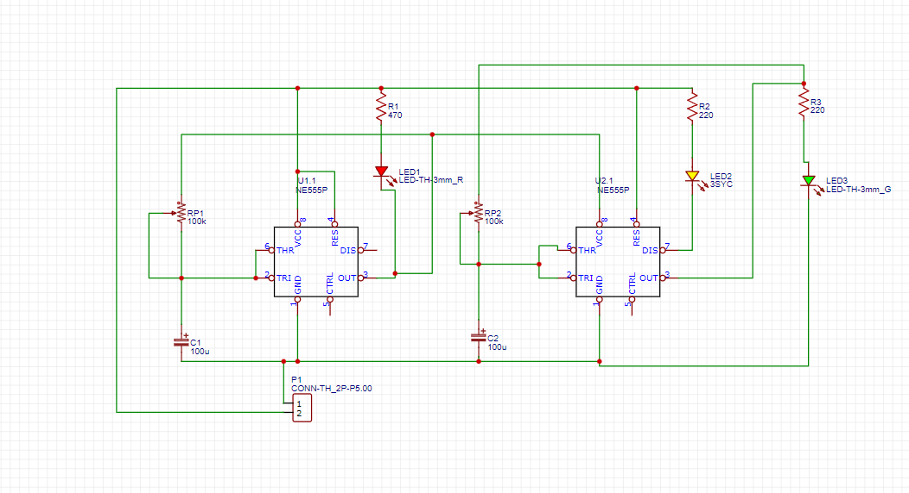
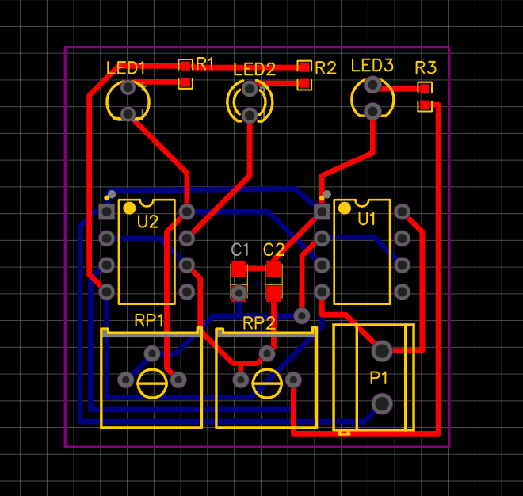
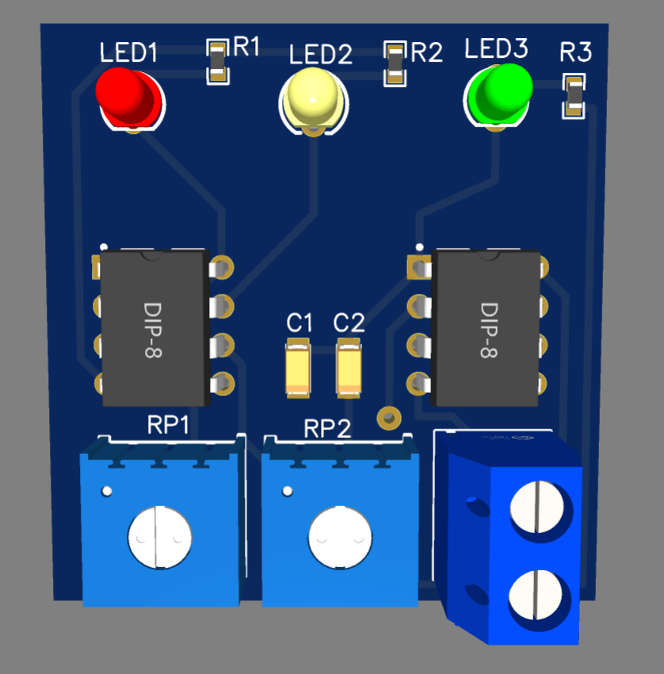
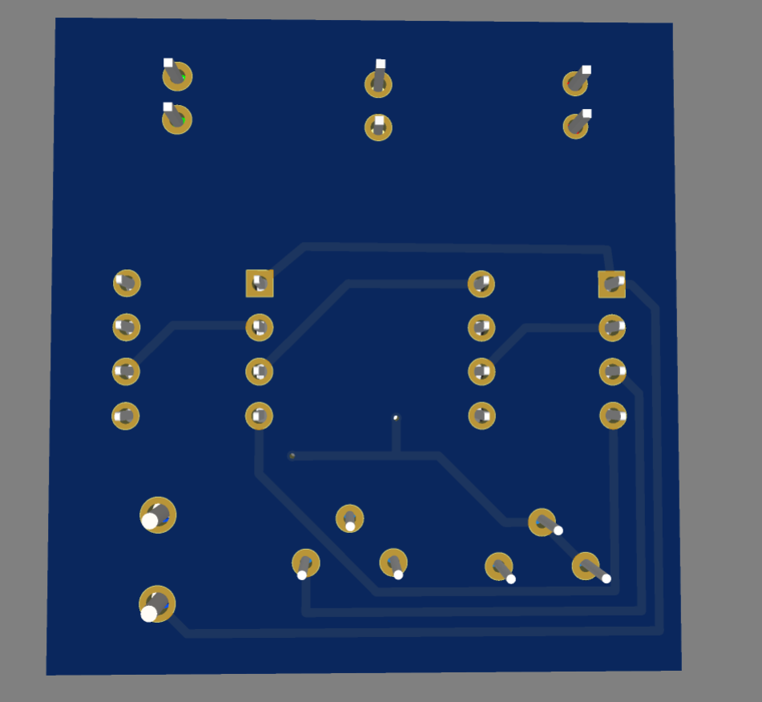

# 🚦 Traffic Light Controller PCB using Dual NE555 Timer ICs

A compact **Traffic Light Controller PCB** designed using ** NE555 Timer ICs** in **EasyEDA**. This project simulates the operation of a traffic signal system with **Red, Yellow, and Green LEDs**, featuring adjustable timing through potentiometers.

---

## 📸 Project Preview

### 🔹 Schematic Diagram

### 🔹 PCB Layout

### 🔹 3D PCB - Top View

### 🔹 3D PCB - Bottom View

## ✨ Features

- 🚦 Traffic light sequence simulation
- ⏱ Adjustable timing using potentiometers
- 💡 Red, Yellow & Green LED indicators
- 🛠 Compact PCB layout
- 📐 Designed in EasyEDA
- ✅ PCB Design Rule Check (DRC) verified
- 📦 Ready for PCB fabrication

---

## 🛠 Components Used

| Component | Quantity |
|-----------|---------:|
| NE555 Timer IC | 2 |
| LEDs (Red, Yellow, Green) | 3 |
| Potentiometer (100kΩ) | 2 |
| Resistors | 3 |
| Capacitors | 2 |
| 2-Pin Terminal Block | 1 |

---

## 🧠 Working Principle

The circuit uses ** NE555 Timer ICs** configured to generate timing pulses that control the illumination of the **Red**, **Yellow**, and **Green** LEDs. The potentiometers allow the timing intervals to be adjusted, demonstrating the basic operation of a traffic signal controller.

---

## 💻 Software Used

- EasyEDA
- GitHub
---

## 🎯 Skills Demonstrated

- Electronic Circuit Design
- PCB Schematic Design
- PCB Layout Design
- Component Placement
- PCB Routing
- Design Rule Check (DRC)
- 3D PCB Visualization
- Hardware Design Workflow

---

## 🚀 Future Improvements

- Add automatic traffic light sequencing
- Integrate microcontroller-based control
- Add pedestrian crossing signal
- Include countdown timer display
- Expand for smart traffic management

---

## 🤝 Contributions

Suggestions and feedback are always welcome!

If you find this project useful, feel free to **Star ⭐ this repository**.

---

## 👨‍💻 Author

**Azmeera Bannu**

Electronics & Communication Engineering Student

Interested in:
- PCB Design
- Embedded Systems
- ESP32
- IoT
- Hardware Development

GitHub: https://github.com/bannu20

---

### ⭐ If you like this project, don't forget to Star the repository!
